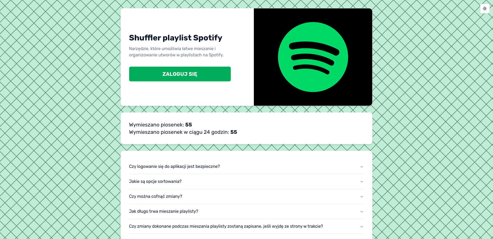
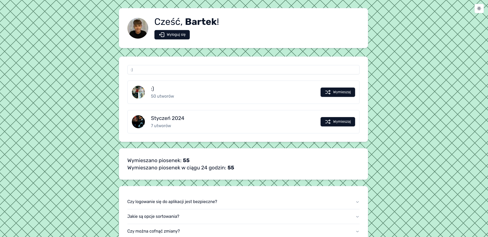

# Shuffler for Spotify Playlists

A tool that allows you to easily mix and organize tracks in Spotify playlists.

## Preview

### Homepage (Welcome Screen)


### Dashboard (Shuffling Playlists)


### Full Demo
<video controls>
  <source src="./docs/demo.mp4" type="video/mp4">
  Your browser does not support the video tag.
</video>

---

## Features

- Option to download profile picture and playlist cover image
- Count of shuffled songs
- Shuffle according to specified criteria:
  - By date added to playlist (oldest first)
  - By date added to playlist (newest first)
  - By song length (ascending)
  - By song length (descending)
  - By popularity
  - Randomly

## Tech Stack

- **Next.js 14**
- **Next Auth**
- **TailwindCSS + Shadcn UI**
- **TypeScript**

## Getting Started

### Prerequisites

Make sure you have the following installed:

- Node.js
- Yarn or NPM

### Installation

1. Clone the repository:

   ```bash
   git clone https://github.com/gebraryz/spotify-playlists-shuffler

   cd spotify-playlists-shuffler
   ```
2. Install dependencies using either Yarn or NPM:

    * With Yarn:

      ```bash
      yarn install
      ```

    * With NPM:

      ```bash
      npm install
      ```

3. Configure environment variables:
    * Copy the `.env.local.example` file to `.env.local`:

      ```bash
        cp .env.local.example .env.local
      ```

4. Set up the database: before starting the application, you need to create a PostgreSQL database. Once the database is created, run the following command to create the necessary tables:

  * With Yarn:
    ```bash
    yarn prisma:push
    ```

  * With NPM:
    ```bash
    npm run prisma:push
    ```

### Obtaining Spotify API Tokens

To obtain Spotify API tokens:

1. **Create a Spotify Developer Account**
   Go to the [Spotify Developer Dashboard](https://developer.spotify.com/dashboard/login) and log in with your Spotify account. If you don’t have one, create a new account.

2. **Create an Application**
   After logging in, create a new app by clicking "Create an App." You’ll receive a **Client ID** and **Client Secret**.

3. **Set Redirect URIs**
   In your app settings, add the redirect URI that Spotify will use to return the user to your app after authorization. For your project, this should be `/api/auth/callback/spotify`.

4. **Update Environment Variables**
   In your Spotify Developer Dashboard, you'll find all the necessary tokens and credentials. Update your `.env.local` file with these tokens.

### Development

To start the development server, use either Yarn or npm:

* With Yarn:

  ```bash
  yarn develop
  ```

* With NPM:

  ```bash
  npm install
  ```

The application will be available at `http://localhost:3000`.

## Contributing

Pull requests are welcome. For major changes, please open an issue first to discuss what you would like to change.
